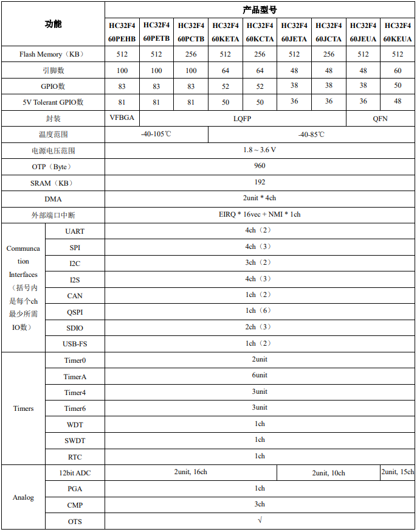

# [HC32F460](https://github.com/SoCXin/HC32F460)

* [HDSC](https://www.hdsc.com.cn/)：[Cortex-M4](https://github.com/SoCXin/Cortex)
* [L5R5](https://github.com/SoCXin/Level)：200 MHz * 1.25 DMIPS/MHz (680CoreMark)

## [简介](https://github.com/SoCXin/HC32F460/wiki)

[HC32F460](https://github.com/SoCXin/HC32F460)

### 关键特性

* 4 x USART
* 2 x 12bit 2.5MSPS ADC
* 3 x CMP
* PGA

#### 封装规格

* UFBGA100 (7×7mm)
* LQFP100 (14×14mm)
* LQFP64 (10×10mm)
* LQFP48 (7×7mm)
* QFN60 (7×7mm)
* QFN48 (5×5mm)

### [选型建议](https://github.com/SoCXin)

[HC32F460](https://github.com/SoCXin/HC32F460)

### [探索芯世界 www.SoC.xin](http://www.SoC.Xin)
