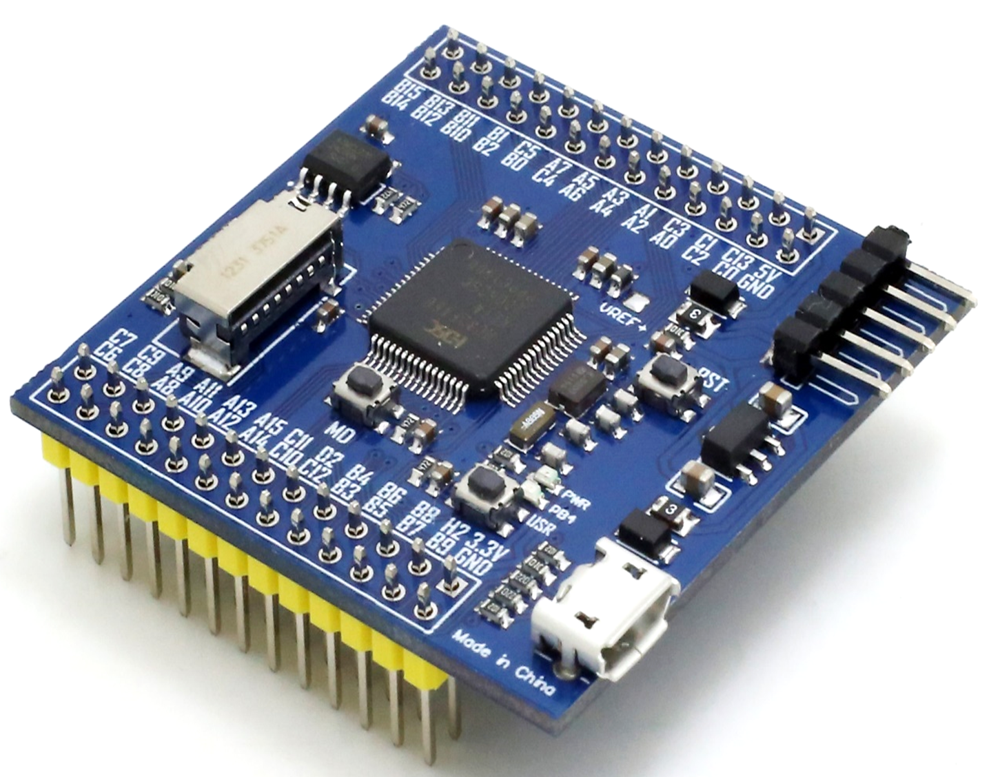

# [HC32F460](https://github.com/SoCXin/HC32F460)

* [hdsc](https://www.hdsc.com.cn/): [Cortex-M4](https://github.com/SoCXin/Cortex)
* [L5R5](https://github.com/SoCXin/Level): 200 MHz x 1.25 DMIPS/MHz, [680CoreMark](https://www.eembc.org/coremark/scores.php)

## [简介](https://github.com/SoCXin/HC32F460/wiki)

[HC32F460](https://github.com/SoCXin/HC32F460)

### 关键特性

* 4 x USART
* 2 x 12bit 2.5MSPS ADC
* 3 x CMP
* 可编程增益放大器PGA
* 片上温度传感器(OTS)

### [资源收录](https://github.com/SoCXin)

* [参考资源](src/)
* [参考文档](docs/)
* [参考工程](project/)

### [选型建议](https://github.com/SoCXin)

[HC32F460](https://github.com/SoCXin/HC32F460)

* UFBGA100 (7×7mm)
* LQFP100 (14×14mm)
* LQFP64 (10×10mm)
* LQFP48 (7×7mm)
* QFN60 (7×7mm)
* QFN48 (5×5mm)

#### 相关开发板

### [探索芯世界 www.SoC.xin](http://www.SoC.Xin)
